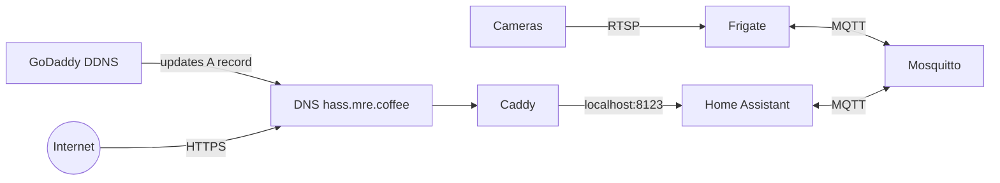

# Home automation hub

Config-as-code for a home automation and security hub running on a Raspberry Pi.
Services are packaged as Podman containers and managed with systemd Quadlets via Ansible.

The deployment entrypoint is [`ansible/site.yml`](ansible/site.yml).

## Architecture

| Service | Role |
| --- | --- |
| **Caddy** | TLS reverse proxy terminating HTTPS for Home Assistant |
| **GoDaddy DDNS** | Keeps the public `hass` DNS A record pointed at the home IP |
| **Home Assistant** | Home automation core and UI |
| **Frigate** | NVR / camera detection for the security side of the hub |
| **Mosquitto** | MQTT broker shared by Home Assistant and Frigate |
| **Podman** | Container runtime underneath the Quadlet units |



## Deploy

1. Copy [`ansible/group_vars/all/secrets.yml.example`](ansible/group_vars/all/secrets.yml.example) to `ansible/group_vars/all/secrets.yml` and fill in real values (keep that file encrypted and out of git).
2. Confirm the Pi is reachable from [`ansible/hosts`](ansible/hosts).
3. Run:

```bash
ansible-playbook -i ansible/hosts ansible/site.yml
```

Only roles that have been validated against the live host are enabled in `site.yml`. Details for rehearsal and secrets live in [`ansible/README.md`](ansible/README.md).
